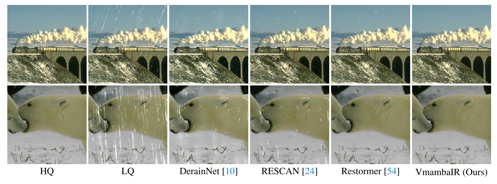

<div align="center">
<p align="center">  </p>
</div>

# VmambaIR: Visual State Space Model for Image Restoration

[Yuan Shi](https://github.com/shiyuan7), [Bin Xia](https://github.com/Zj-BinXia), [Xiaoyu Jin](https://github.com/xyjin01), [Xing Wang](https://github.com/AlphacatPlus/VmambaIR), [Tianyu Zhao](https://github.com/AlphacatPlus/VmambaIR), [Xin Xia](https://github.com/AlphacatPlus/VmambaIR), [Xuefeng Xiao](https://github.com/AlphacatPlus/VmambaIR), and [Wenming Yang](https://scholar.google.com/citations?user=vsE4nKcAAAAJ&hl=zh-CN), "VmambaIR: Visual State Space Model for Image Restoration", arXiv, 2024

[[arXiv](https://arxiv.org/abs/2403.11423)] [[supplementary material]()] [[visual results]()] [pretrained models]

#### 🔥🔥🔥 News

- **2024-03-18:** This repo is released.

---

> **Abstract:** Image restoration is a critical task in low-level computer vision, aiming to restore high-quality images from degraded inputs. Various models, such as convolutional neural networks (CNNs), generative adversarial networks (GANs), transformers, and diffusion models (DMs), have been employed to address this problem with significant impact. However, CNNs have limitations in capturing long-range dependencies. DMs require large prior models and computationally intensive denoising steps. Transformers have powerful modeling capabilities but face challenges due to quadratic complexity with input image size. To address these challenges, we propose VmambaIR, which introduces State Space Models (SSMs) with linear complexity into comprehensive image restoration tasks. We utilize a Unet architecture to stack our proposed Omni Selective Scan (OSS) blocks, consisting of an OSS module and an Efficient Feed-Forward Network (EFFN). Our proposed omni selective scan mechanism overcomes the unidirectional modeling limitation of SSMs by efficiently modeling image information flows in all six directions. Furthermore, we conducted a comprehensive evaluation of our VmambaIR across multiple image restoration tasks, including image deraining, single image super-resolution, and real-world image super-resolution. Extensive experimental results demonstrate that our proposed VmambaIR achieves state-of-the-art (SOTA) performance with much fewer computational resources and parameters. Our research highlights the potential of state space models as promising alternatives to the transformer and CNN architectures in serving as foundational frameworks for next-generation low-level visual tasks.


---
Single Imgae Super-Resolution

[](https://imgsli.com/MjQ4MjI5) [](https://imgsli.com/MjQ4MjI2) [](https://imgsli.com/MjQ4MjI3) [](https://imgsli.com/MjQ4MjI4)


Real-World Imgae Super-Resolution

[](https://imgsli.com/MjQ4MjMw) [](https://imgsli.com/MjQ4MjMx) [](https://imgsli.com/MjQ4MjMy) [](https://imgsli.com/MjQ4MjM0)


Image Deraining

[](https://imgsli.com/MjQ4MjM3) [](https://imgsli.com/MjQ4MjM5) [](https://imgsli.com/MjQ4MjQz) [](https://imgsli.com/MjQ4MjQ1)

---


## ⚒️ TODO

* [ ] Release code and pretrained models

## 🔗 Contents

1. Datasets
1. Models
1. Training
1. Testing
1. [Results](#results)
1. [Citation](#citation)
1. [Acknowledgements](#acknowledgements)

## <a name="results"></a>🔎 Results

We achieved state-of-the-art performance on multiple image restoration tasks. Detailed results can be found in the paper.

<details>
<summary>Evaluation on Single Image Super-Resolution (click to expand)</summary>


- quantitative comparisons in Table 1 of the main paper

<p align="center">
  
</p>


- visual comparison in Figure 5 of the main paper

<p align="center">
  
</p>
</details>


<details>
<summary>Evaluation on Real-World Image Super-Resolution (click to expand)</summary>


- quantitative comparisons in Table 2 of the main paper

<p align="center">
  
</p>


- visual comparison in Figure 6 of the main paper

<p align="center">
  
</p>

</details>


<details>
<summary>Evaluation on Image Deraining (click to expand)</summary>


- quantitative comparisons in Table 2 of the main paper

<p align="center">
  
</p>


- visual comparison in Figure 6 of the main paper

<p align="center">
  
</p>

</details>

## <a name="citation"></a>📎 Citation

If you find the code helpful in your resarch or work, please cite the following paper(s).

```
@article{chen2023image,
  title={VmambaIR: Visual State Space Model for Image Restoration},
  author={Shi, Yuan and Xia, Bin and Jin, Xiaoyu and Wang, Xing and Zhao, Tianyu and Xia, Xin and Xiao, Xuefeng and Yang, Wenming},
  journal={arXiv preprint arXiv:2403.11423},
  year={2024}
}
```

## <a name="acknowledgements"></a>💡 Acknowledgements

This code is built on [BasicSR](https://github.com/XPixelGroup/BasicSR), [Vmamba](https://github.com/MzeroMiko/VMamba).

